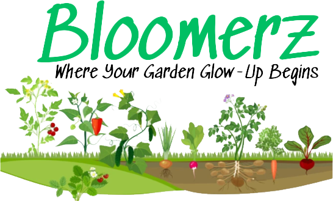

# 🌱 **Bloomerz**

> Your Personal Garden Management App

---

## 📸 **Screenshot/Logo**

---

## 🌿 **About Bloomerz**

**Bloomerz** is an intuitive and beautifully designed gardening app that helps users organize and manage their garden plots, plants, and watering schedules with ease. Our goal is to make gardening as effortless and enjoyable as possible.

### **Why We Built Bloomerz**

We believe that every gardener deserves an app that simplifies the process of tracking plant growth, watering needs, and organizing multiple garden plots. **Bloomerz** provides a clean, simple, and user-friendly interface to track each step of your gardening journey.

---

## 🚀 **Getting Started**

**Live Application**: [Visit Bloomerz](https://bloomerz-ad5875097a53.herokuapp.com/)

**Project Planning Materials**: [View Planning Docs](https://trello.com/b/ngmNblq0/bloomerz)

---

## 🙌 **Attributions**

Here are the resources, libraries, and third-party assets that helped make **Bloomerz** possible:

- **Tailwind CSS**: Used to create modern, responsive, and mobile-friendly layouts. [View Tailwind CSS](https://tailwindcss.com/)
- **Alpine.js**: Used for interactive UI elements like dropdown menus. [View Alpine.js](https://alpinejs.dev/)
- **Google Fonts**: Used the **Lora** font for the elegant and minimal design. [View Lora on Google Fonts](https://fonts.google.com/)
- **Django**: The Python-based web framework that powers Bloomerz. [View Django Docs](https://docs.djangoproject.com/)

---

## ⚙️ **Technologies Used**

Here are the technologies used in building **Bloomerz**:

- **Languages**: Python, HTML, CSS, JavaScript
- **Framework**: Django (Back-end), Tailwind CSS (Front-end)
- **Database**: PostgreSQL
- **Version Control**: GitHub
- **Deployment**: Heroku

---

## 🌱 **Next Steps**

We’re constantly looking for ways to grow and enhance **Bloomerz**. Here are some of the planned features for future releases:

- **Garden Community**: Allow users to share their gardens and plots with other users.
- **API Integration**: Add the ability for users to access plant information and care instructions.
- **Reminders and Notifications**: Implement reminders for watering and plant care via email or push notifications.

---

### **Contributors**

andrewSantanastaso: Andrew Santanastaso
melissaceee: Melissa Cheng
xsm3z: Michael Zhang
